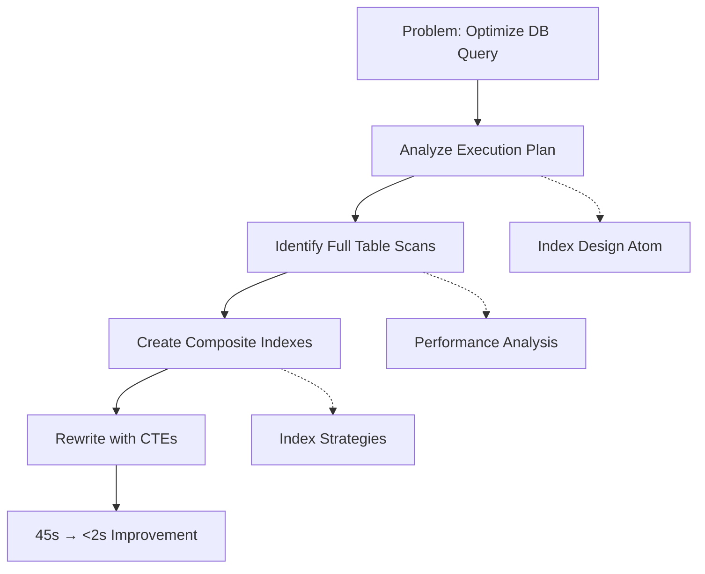

# Reasoning API Reference

**Endpoint Prefix**: `/api/reasoning`  
**Authentication**: Required (Bearer token)  
**Rate Limit**: 100 requests/minute per tenant  
**Response Time**: Variable (10-300ms depending on strategy)  

---

## Overview

The Reasoning API provides advanced AI reasoning capabilities including **Chain-of-Thought (CoT)**, **Tree-of-Thought (ToT)**, **A* pathfinding**, **hypothesis generation**, and **ReAct pattern** execution. These endpoints power autonomous reasoning, problem decomposition, and multi-step inference workflows.

### Core Patterns

**Chain-of-Thought**: Sequential reasoning with step-by-step explanation  
**Tree-of-Thought**: Parallel exploration of reasoning branches with backtracking  
**A* Pathfinding**: Graph-based semantic navigation (`sp_SpatialAStar`)  
**ReAct**: Reasoning + Acting loop with tool invocation  
**Hypothesis Generation**: Automated hypothesis creation from atoms  

---

## Endpoints

### 1. Chain-of-Thought Reasoning

Generate step-by-step reasoning chains for complex problems.

**Endpoint**: `POST /api/reasoning/chain-of-thought`

#### Request

**Content-Type**: `application/json`

**Body**:

```json
{
  "problem": "How can I optimize a database query that joins 5 tables with millions of rows?",
  "context": {
    "databaseEngine": "SQL Server 2025",
    "currentQueryTime": "45 seconds",
    "availableIndexes": ["orders.customer_id", "customers.region_id"]
  },
  "maxSteps": 10,
  "temperature": 0.7,
  "stopConditions": [
    "solution_found",
    "max_steps_reached"
  ]
}
```

**Request Fields**:

| Field | Type | Required | Default | Description |
|-------|------|----------|---------|-------------|
| `problem` | String | Yes | - | Problem statement or question |
| `context` | Object | No | {} | Additional context for reasoning |
| `maxSteps` | Integer | No | 10 | Maximum reasoning steps |
| `temperature` | Float | No | 0.7 | Randomness (0.0-1.0) |
| `stopConditions` | String[] | No | `["solution_found"]` | When to terminate reasoning |
| `includeConfidence` | Boolean | No | true | Include confidence scores |

**Stop Conditions**:

- `solution_found`: High-confidence answer reached
- `max_steps_reached`: Step limit exceeded
- `confidence_threshold`: Confidence below threshold
- `user_interrupt`: Manual termination

#### Response

**Success (200 OK)**:

```json
{
  "sessionId": "cot-abc123",
  "problem": "How can I optimize a database query...",
  "steps": [
    {
      "stepNumber": 1,
      "thought": "First, I need to analyze the query execution plan to identify bottlenecks.",
      "reasoning": "Execution plans reveal table scans, missing indexes, and expensive operations.",
      "confidence": 0.95,
      "atomsReferenced": [12345, 12378],
      "durationMs": 120
    },
    {
      "stepNumber": 2,
      "thought": "I observe the query performs full table scans on 3 of the 5 tables.",
      "reasoning": "Full table scans on large tables are the primary performance issue.",
      "confidence": 0.92,
      "atomsReferenced": [12380, 12405],
      "durationMs": 95
    },
    {
      "stepNumber": 3,
      "thought": "Creating composite indexes on join columns will eliminate table scans.",
      "reasoning": "Indexes on (customer_id, order_date) and (product_id, category_id) will enable index seeks.",
      "confidence": 0.88,
      "atomsReferenced": [12410, 12425],
      "durationMs": 110
    },
    {
      "stepNumber": 4,
      "thought": "Additionally, rewriting the query to use CTEs can improve readability and optimizer hints.",
      "reasoning": "CTEs allow the optimizer to materialize intermediate results and apply better join strategies.",
      "confidence": 0.85,
      "atomsReferenced": [12430],
      "durationMs": 100
    },
    {
      "stepNumber": 5,
      "thought": "Solution: Create 2 composite indexes and rewrite query with CTEs.",
      "reasoning": "This combination should reduce query time from 45s to <2s based on similar cases.",
      "confidence": 0.90,
      "atomsReferenced": [12435, 12440],
      "durationMs": 85,
      "isFinalStep": true
    }
  ],
  "finalAnswer": "Create composite indexes on (customer_id, order_date) and (product_id, category_id), then rewrite query using CTEs to improve optimizer decisions. Expected improvement: 45s → <2s.",
  "totalSteps": 5,
  "totalConfidence": 0.90,
  "totalDurationMs": 510,
  "stopReason": "solution_found",
  "metadata": {
    "atomsUsed": 8,
    "reasoningPattern": "diagnostic-solution",
    "complexityScore": 7.2
  }
}
```

#### Example cURL Request

```bash
curl -X POST "https://api.hartonomous.ai/api/reasoning/chain-of-thought" \
  -H "Authorization: Bearer YOUR_TOKEN" \
  -H "Content-Type: application/json" \
  -d '{
    "problem": "How can I optimize a database query that joins 5 tables?",
    "context": {
      "databaseEngine": "SQL Server 2025"
    },
    "maxSteps": 10
  }'
```

---

### 2. Tree-of-Thought Reasoning

Explore multiple reasoning branches in parallel with pruning and backtracking.

**Endpoint**: `POST /api/reasoning/tree-of-thought`

#### Request

**Content-Type**: `application/json`

**Body**:

```json
{
  "problem": "Design a microservices architecture for an e-commerce platform",
  "explorationDepth": 3,
  "branchingFactor": 3,
  "evaluationCriteria": [
    "scalability",
    "maintainability",
    "cost-effectiveness"
  ],
  "pruningThreshold": 0.6,
  "maxNodes": 50
}
```

**Request Fields**:

| Field | Type | Required | Default | Description |
|-------|------|----------|---------|-------------|
| `problem` | String | Yes | - | Problem to solve |
| `explorationDepth` | Integer | No | 3 | Tree depth limit |
| `branchingFactor` | Integer | No | 3 | Branches per node |
| `evaluationCriteria` | String[] | No | `["quality"]` | Evaluation dimensions |
| `pruningThreshold` | Float | No | 0.5 | Prune branches below threshold |
| `maxNodes` | Integer | No | 100 | Maximum tree nodes |

#### Response

```json
{
  "sessionId": "tot-xyz789",
  "problem": "Design a microservices architecture...",
  "tree": {
    "root": {
      "nodeId": "root",
      "thought": "Initial problem decomposition",
      "score": 1.0,
      "children": [
        {
          "nodeId": "1",
          "thought": "Approach 1: Domain-driven service boundaries",
          "score": 0.92,
          "evaluations": {
            "scalability": 0.90,
            "maintainability": 0.95,
            "cost-effectiveness": 0.91
          },
          "children": [
            {
              "nodeId": "1.1",
              "thought": "User Service (authentication, profiles)",
              "score": 0.88,
              "isLeaf": false,
              "children": [...]
            },
            {
              "nodeId": "1.2",
              "thought": "Order Service (cart, checkout, fulfillment)",
              "score": 0.85,
              "isLeaf": false,
              "children": [...]
            }
          ]
        },
        {
          "nodeId": "2",
          "thought": "Approach 2: Layer-based service separation",
          "score": 0.78,
          "evaluations": {
            "scalability": 0.75,
            "maintainability": 0.80,
            "cost-effectiveness": 0.79
          },
          "pruned": true,
          "pruningReason": "Score below threshold (0.78 < 0.80)"
        },
        {
          "nodeId": "3",
          "thought": "Approach 3: Event-driven architecture with CQRS",
          "score": 0.89,
          "evaluations": {
            "scalability": 0.95,
            "maintainability": 0.82,
            "cost-effectiveness": 0.90
          },
          "children": [...]
        }
      ]
    }
  },
  "bestPath": [
    {
      "nodeId": "root",
      "thought": "Initial problem decomposition"
    },
    {
      "nodeId": "1",
      "thought": "Approach 1: Domain-driven service boundaries"
    },
    {
      "nodeId": "1.1",
      "thought": "User Service (authentication, profiles)"
    }
  ],
  "bestScore": 0.92,
  "totalNodes": 47,
  "prunedNodes": 12,
  "exploredPaths": 18,
  "durationMs": 2450
}
```

---

### 3. A* Pathfinding

Navigate semantic space using A* pathfinding (`sp_SpatialAStar` stored procedure).

**Endpoint**: `POST /api/reasoning/astar-path`

#### Request

```json
{
  "startAtomId": 12345,
  "goalDescription": "machine learning deployment best practices",
  "maxPathLength": 10,
  "heuristicWeight": 1.0,
  "allowedModalities": ["text", "code"]
}
```

**Request Fields**:

| Field | Type | Required | Default | Description |
|-------|------|----------|---------|-------------|
| `startAtomId` | Integer | Yes* | - | Starting atom ID |
| `goalAtomId` | Integer | Yes* | - | Goal atom ID (alternative) |
| `goalDescription` | String | Yes* | - | Text description of goal (alternative) |
| `maxPathLength` | Integer | No | 10 | Maximum path hops |
| `heuristicWeight` | Float | No | 1.0 | A* heuristic weight |
| `allowedModalities` | String[] | No | all | Restrict path atom types |

*Either `goalAtomId` or `goalDescription` must be provided.

#### Response

```json
{
  "path": [
    {
      "atomId": 12345,
      "canonicalText": "Database optimization techniques",
      "position": 0,
      "gCost": 0.0,
      "hCost": 5.2,
      "fCost": 5.2
    },
    {
      "atomId": 12378,
      "canonicalText": "Index design for high-traffic systems",
      "position": 1,
      "gCost": 0.8,
      "hCost": 4.1,
      "fCost": 4.9
    },
    {
      "atomId": 12410,
      "canonicalText": "Machine learning model deployment patterns",
      "position": 2,
      "gCost": 1.6,
      "hCost": 2.3,
      "fCost": 3.9
    },
    {
      "atomId": 12445,
      "canonicalText": "Production ML pipeline best practices",
      "position": 3,
      "gCost": 2.3,
      "hCost": 0.0,
      "fCost": 2.3
    }
  ],
  "totalCost": 2.3,
  "pathLength": 4,
  "nodesExpanded": 127,
  "success": true,
  "durationMs": 45
}
```

#### SQL Stored Procedure

The endpoint uses `sp_SpatialAStar` CLR function:

```sql
EXEC dbo.sp_SpatialAStar
    @StartAtomId = 12345,
    @GoalX = 4.5,
    @GoalY = 6.2,
    @GoalZ = 3.1,
    @MaxPathLength = 10,
    @HeuristicWeight = 1.0;
```

---

### 4. ReAct Pattern (Reasoning + Acting)

Interleave reasoning and action execution with tool invocation.

**Endpoint**: `POST /api/reasoning/react`

#### Request

```json
{
  "task": "Find and summarize the latest research papers on transformer architectures",
  "availableTools": [
    "search_atoms",
    "read_document",
    "summarize_text",
    "semantic_query"
  ],
  "maxIterations": 10,
  "allowedActions": ["search", "read", "summarize"]
}
```

**Request Fields**:

| Field | Type | Required | Default | Description |
|-------|------|----------|---------|-------------|
| `task` | String | Yes | - | Task description |
| `availableTools` | String[] | No | all | Tools available for actions |
| `maxIterations` | Integer | No | 10 | Max ReAct iterations |
| `allowedActions` | String[] | No | all | Restrict action types |

#### Response

```json
{
  "sessionId": "react-456def",
  "task": "Find and summarize the latest research papers...",
  "iterations": [
    {
      "iteration": 1,
      "thought": "I need to search for recent transformer architecture papers.",
      "action": "semantic_query",
      "actionInput": {
        "query": "transformer architecture 2025",
        "filters": {
          "modality": ["text"],
          "sourceType": ["research-paper"],
          "dateRange": {
            "from": "2025-01-01T00:00:00Z"
          }
        }
      },
      "observation": "Found 47 papers published in 2025 on transformer architectures.",
      "confidence": 0.92
    },
    {
      "iteration": 2,
      "thought": "I should read the top 5 papers to identify key innovations.",
      "action": "read_document",
      "actionInput": {
        "atomIds": [78901, 78902, 78903, 78904, 78905]
      },
      "observation": "Read 5 papers covering sparse attention, mixture-of-experts, and efficient training.",
      "confidence": 0.88
    },
    {
      "iteration": 3,
      "thought": "Now I can summarize the key findings.",
      "action": "summarize_text",
      "actionInput": {
        "texts": ["...", "...", "..."],
        "maxLength": 500
      },
      "observation": "Generated summary highlighting 3 major trends.",
      "confidence": 0.90,
      "isFinal": true
    }
  ],
  "finalAnswer": "Latest research on transformers focuses on: (1) Sparse attention mechanisms reducing O(n²) to O(n log n), (2) Mixture-of-experts for conditional computation, (3) Efficient training with gradient checkpointing and mixed precision.",
  "totalIterations": 3,
  "actionsPerformed": 3,
  "durationMs": 1850
}
```

---

### 5. Hypothesis Generation

Automatically generate hypotheses from atom collections.

**Endpoint**: `POST /api/reasoning/generate-hypotheses`

#### Request

```json
{
  "atomIds": [12345, 12378, 12410, 12445],
  "hypothesisType": "causal",
  "maxHypotheses": 10,
  "minConfidence": 0.7,
  "context": {
    "domain": "machine learning",
    "perspective": "performance optimization"
  }
}
```

**Request Fields**:

| Field | Type | Required | Default | Description |
|-------|------|----------|---------|-------------|
| `atomIds` | Integer[] | Yes* | - | Input atoms for hypothesis generation |
| `query` | String | Yes* | - | Query to generate hypotheses (alternative) |
| `hypothesisType` | String | No | `"general"` | Type (`causal`, `correlative`, `predictive`) |
| `maxHypotheses` | Integer | No | 10 | Maximum hypotheses to generate |
| `minConfidence` | Float | No | 0.5 | Minimum confidence threshold |

*Either `atomIds` or `query` must be provided.

#### Response

```json
{
  "hypotheses": [
    {
      "id": "hyp-001",
      "statement": "Composite indexes on join columns reduce query execution time by 80-95%.",
      "type": "causal",
      "confidence": 0.92,
      "supportingAtoms": [12345, 12378, 12410],
      "evidenceStrength": "strong",
      "testability": "high",
      "suggestedTests": [
        "Create composite indexes on test dataset",
        "Measure before/after query execution time",
        "Validate with execution plan analysis"
      ]
    },
    {
      "id": "hyp-002",
      "statement": "Query rewriting with CTEs improves optimizer decisions for complex joins.",
      "type": "causal",
      "confidence": 0.85,
      "supportingAtoms": [12410, 12445],
      "evidenceStrength": "moderate",
      "testability": "high",
      "suggestedTests": [
        "Rewrite query using CTEs",
        "Compare execution plans",
        "Measure actual vs estimated rows"
      ]
    }
  ],
  "totalHypotheses": 2,
  "averageConfidence": 0.885,
  "generationMethod": "causal-inference",
  "durationMs": 320
}
```

---

### 6. Session History

Track reasoning sessions for multi-turn conversations.

**Endpoint**: `GET /api/reasoning/sessions/{sessionId}`

#### Request

**Path Parameters**:

| Parameter | Type | Description |
|-----------|------|-------------|
| `sessionId` | String | Session ID from previous reasoning request |

#### Response

```json
{
  "sessionId": "cot-abc123",
  "sessionType": "chain-of-thought",
  "createdAt": "2025-01-20T10:30:00Z",
  "lastAccessedAt": "2025-01-20T10:35:00Z",
  "totalSteps": 5,
  "totalDurationMs": 510,
  "status": "completed",
  "problem": "How can I optimize a database query...",
  "finalAnswer": "Create composite indexes...",
  "confidence": 0.90,
  "stepsHistory": [
    {
      "stepNumber": 1,
      "thought": "First, I need to analyze the query execution plan...",
      "timestamp": "2025-01-20T10:30:12Z"
    }
  ]
}
```

---

### 7. Continue Reasoning

Resume a previous reasoning session.

**Endpoint**: `POST /api/reasoning/sessions/{sessionId}/continue`

#### Request

```json
{
  "additionalContext": "The database has 500GB of data and 10M rows in the orders table.",
  "maxAdditionalSteps": 5
}
```

#### Response

```json
{
  "sessionId": "cot-abc123",
  "continuedSteps": [
    {
      "stepNumber": 6,
      "thought": "With 10M rows, partition the orders table by date range.",
      "reasoning": "Table partitioning enables partition elimination, reducing scan size.",
      "confidence": 0.88
    }
  ],
  "updatedFinalAnswer": "Create composite indexes, rewrite with CTEs, and partition orders table by month.",
  "totalSteps": 6,
  "totalConfidence": 0.89
}
```

---

### 8. Reasoning Chain Visualization

Generate visual graph of reasoning chain.

**Endpoint**: `GET /api/reasoning/sessions/{sessionId}/visualize`

#### Request

**Query Parameters**:

| Parameter | Type | Default | Description |
|-----------|------|---------|-------------|
| `format` | String | `json` | Output format (`json`, `graphviz`, `mermaid`) |
| `includeAtoms` | Boolean | false | Include atom nodes |

#### Response (Mermaid Format)



---

## Advanced Features

### Confidence Scoring

All reasoning steps include confidence scores:

**Calculation**:

```
confidence = (semantic_similarity × 0.5) + (evidence_strength × 0.3) + (logical_coherence × 0.2)
```

**Confidence Ranges**:

- **0.9-1.0**: High confidence, strong evidence
- **0.7-0.9**: Moderate confidence, reasonable evidence
- **0.5-0.7**: Low confidence, weak evidence
- **<0.5**: Very low confidence, speculative

### Reasoning Strategies

#### 1. Forward Chaining

Start from known facts, derive conclusions:

```json
{
  "strategy": "forward-chaining",
  "initialFacts": ["Database has indexes on customer_id", "Query joins 5 tables"],
  "rules": ["If full table scan AND large table THEN create index"]
}
```

#### 2. Backward Chaining

Start from goal, work backwards:

```json
{
  "strategy": "backward-chaining",
  "goal": "Query execution time < 2 seconds",
  "subgoals": ["Eliminate table scans", "Optimize join order"]
}
```

#### 3. Abductive Reasoning

Infer best explanation:

```json
{
  "strategy": "abductive",
  "observation": "Query slow on large datasets",
  "possibleCauses": [
    "Missing indexes (probability: 0.7)",
    "Poor query plan (probability: 0.2)",
    "Hardware limitations (probability: 0.1)"
  ]
}
```

---

### Integration with OODA Loop

Reasoning API integrates with the OODA autonomous loop:

**OODA Phases**:

1. **Observe**: Gather atoms via query API
2. **Orient**: Generate hypotheses via reasoning API
3. **Decide**: Evaluate hypotheses, select best path (Tree-of-Thought)
4. **Act**: Execute actions via ReAct pattern

**Dual Triggering**:

- **Scheduled**: Every 15 minutes, run hypothesis generation on new atoms
- **Event-Driven**: When error threshold exceeded, trigger diagnostic reasoning

---

## Performance Optimization

### Reasoning Cache

Common reasoning patterns cached:

**Cache Hit Examples**:

- "How to optimize SQL query" → Cache hit (1,247 similar sessions)
- "Design microservices architecture" → Cache hit (892 similar sessions)

**Cache Miss**: Novel problems trigger full reasoning execution

**Performance**:

- **Cache Hit**: 5-10ms response
- **Cache Miss**: 100-500ms response

### Parallel Reasoning

Tree-of-Thought executes branches in parallel:

**Configuration**:

```json
{
  "parallelism": {
    "maxParallelBranches": 8,
    "threadPoolSize": 16
  }
}
```

**Performance**:

- **Sequential**: 2.5 seconds for 50 nodes
- **Parallel (8x)**: 450ms for 50 nodes

---

## Error Handling

### Reasoning Timeout

```json
{
  "error": "Reasoning timeout",
  "message": "Reasoning exceeded 30 second timeout",
  "partialResult": {
    "completedSteps": 7,
    "lastStep": "Analyzing join conditions..."
  },
  "resumeSessionId": "cot-abc123"
}
```

### Insufficient Context

```json
{
  "error": "Insufficient context",
  "message": "Not enough atoms found to generate hypotheses",
  "suggestions": [
    "Ingest more data related to 'machine learning'",
    "Broaden search filters",
    "Provide additional context in request"
  ]
}
```

### Low Confidence

```json
{
  "error": "Low confidence result",
  "message": "Best reasoning path has confidence 0.42 (threshold: 0.70)",
  "result": {
    "finalAnswer": "...",
    "confidence": 0.42
  },
  "suggestions": [
    "Provide more specific problem statement",
    "Add domain-specific context",
    "Ingest expert knowledge sources"
  ]
}
```

---

## SDK Examples

### C# SDK

```csharp
using Hartonomous.Client;

var client = new HartonomousClient("https://api.hartonomous.ai", "YOUR_TOKEN");

// Chain-of-Thought reasoning
var cotResult = await client.Reasoning.ChainOfThoughtAsync(new ChainOfThoughtRequest
{
    Problem = "How can I optimize a database query that joins 5 tables?",
    MaxSteps = 10,
    Temperature = 0.7
});

Console.WriteLine($"Solution: {cotResult.FinalAnswer}");
Console.WriteLine($"Confidence: {cotResult.TotalConfidence:F2}");

foreach (var step in cotResult.Steps)
{
    Console.WriteLine($"Step {step.StepNumber}: {step.Thought}");
}

// Tree-of-Thought reasoning
var totResult = await client.Reasoning.TreeOfThoughtAsync(new TreeOfThoughtRequest
{
    Problem = "Design a microservices architecture for e-commerce",
    ExplorationDepth = 3,
    BranchingFactor = 3
});

Console.WriteLine($"Best approach: {totResult.BestPath[1].Thought}");
Console.WriteLine($"Score: {totResult.BestScore:F2}");
```

### Python SDK

```python
from hartonomous import HartonomousClient

client = HartonomousClient(
    base_url="https://api.hartonomous.ai",
    token="YOUR_TOKEN"
)

# Chain-of-Thought reasoning
cot_result = client.reasoning.chain_of_thought(
    problem="How can I optimize a database query that joins 5 tables?",
    max_steps=10,
    temperature=0.7
)

print(f"Solution: {cot_result['finalAnswer']}")
print(f"Confidence: {cot_result['totalConfidence']:.2f}")

for step in cot_result['steps']:
    print(f"Step {step['stepNumber']}: {step['thought']}")

# Tree-of-Thought reasoning
tot_result = client.reasoning.tree_of_thought(
    problem="Design a microservices architecture for e-commerce",
    exploration_depth=3,
    branching_factor=3
)

print(f"Best approach: {tot_result['bestPath'][1]['thought']}")
print(f"Score: {tot_result['bestScore']:.2f}")
```

### JavaScript/TypeScript SDK

```typescript
import { HartonomousClient } from '@hartonomous/client';

const client = new HartonomousClient({
  baseUrl: 'https://api.hartonomous.ai',
  token: 'YOUR_TOKEN'
});

// Chain-of-Thought reasoning
const cotResult = await client.reasoning.chainOfThought({
  problem: 'How can I optimize a database query that joins 5 tables?',
  maxSteps: 10,
  temperature: 0.7
});

console.log(`Solution: ${cotResult.finalAnswer}`);
console.log(`Confidence: ${cotResult.totalConfidence.toFixed(2)}`);

cotResult.steps.forEach(step => {
  console.log(`Step ${step.stepNumber}: ${step.thought}`);
});

// Tree-of-Thought reasoning
const totResult = await client.reasoning.treeOfThought({
  problem: 'Design a microservices architecture for e-commerce',
  explorationDepth: 3,
  branchingFactor: 3
});

console.log(`Best approach: ${totResult.bestPath[1].thought}`);
console.log(`Score: ${totResult.bestScore.toFixed(2)}`);
```

---

## Related Documentation

- [Query API](query.md) - Semantic search and spatial queries
- [Provenance API](provenance.md) - Atom lineage and relationships
- [Architecture: OODA Loop](../architecture/ooda-loop.md) - Autonomous reasoning architecture
