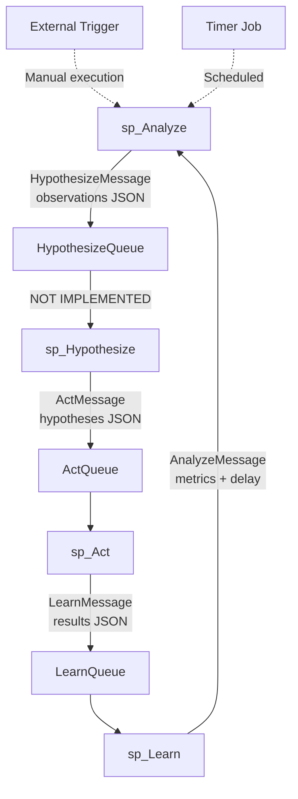

# OODA Loop: Autonomous Database Improvement System

**Status**: Fully Implemented  
**Location**: `src/Hartonomous.Database/Procedures/dbo.sp_Analyze.sql`, `dbo.sp_Act.sql`, `dbo.sp_Learn.sql`  
**Mechanism**: SQL Server Service Broker messaging with asynchronous stored procedure activation

---

## Overview

Hartonomous implements a self-improving system using the **Observe-Orient-Decide-Act-Learn (OODA) loop** entirely within SQL Server. The database autonomously detects performance issues, generates improvement hypotheses, executes safe optimizations, and measures outcomes.

### Implementation

**Service Broker Architecture:**
- **Queues**: `AnalyzeQueue`, `HypothesizeQueue`, `ActQueue`, `LearnQueue`
- **Services**: `AnalyzeService`, `HypothesizeService`, `ActService`, `LearnService`
- **Contracts**: Define message types for each phase transition
- **Activation**: Stored procedures automatically invoked when messages arrive

**The Four Phases:**

```
sp_Analyze (Observe/Orient)
    ↓ HypothesizeMessage
sp_Hypothesize (Decide - NOT YET IMPLEMENTED)
    ↓ ActMessage  
sp_Act (Act)
    ↓ LearnMessage
sp_Learn (Learn)
    ↓ AnalyzeMessage
    └─→ loop restarts
```

---

## Phase 1: Observe & Analyze (`sp_Analyze`)

**File**: `src/Hartonomous.Database/Procedures/dbo.sp_Analyze.sql`

**Actions:**
1. Queries recent inference requests (last 24 hours)
2. Detects performance anomalies using **CLR aggregates**:
   - `IsolationForestScore()` - tree-based outlier detection
   - `LocalOutlierFactor()` - density-based anomaly detection
3. Queries SQL Server Query Store for query regressions
4. Identifies embedding clusters (concept discovery via spatial buckets)
5. Compiles observations as JSON
6. Sends `HypothesizeMessage` to Service Broker

**Key Features:**
- **Gödel Engine Support**: Bypasses performance analysis if message contains compute job (prime search, theorem proving)
- **Dual Detection**: Flags anomalies detected by EITHER IsolationForest OR LocalOutlierFactor
- **Thresholds**: IsolationForest > 0.7, LOF > 1.5

**Current Metrics:**
```sql
{
  "analysisId": "GUID",
  "totalInferences": 1000,
  "avgDurationMs": 245.6,
  "anomalyCount": 12,
  "anomalies": [...],
  "queryStoreRecommendations": [...],
  "patterns": [...]
}
```

---

## Phase 2: Hypothesize (NOT IMPLEMENTED)

**Expected File**: `dbo.sp_Hypothesize.sql` (does not exist)

**Planned Actions:**
1. Receive observations from `sp_Analyze`
2. Generate improvement hypotheses:
   - **IndexOptimization**: Create missing indexes from DMVs
   - **QueryRegression**: Force last-good execution plans
   - **CacheWarming**: Preload frequent embeddings
   - **ConceptDiscovery**: Run clustering on embeddings
   - **ModelRetraining**: Queue dangerous operations for approval
3. Prioritize hypotheses (1-5 scale)
4. Auto-approve safe hypotheses (priority >= 3)
5. Send `ActMessage` to Service Broker

**Current Status**: `sp_Analyze` sends directly to `sp_Act`, skipping this phase

---

## Phase 3: Act (`sp_Act`)

**File**: `src/Hartonomous.Database/Procedures/dbo.sp_Act.sql`

**Actions:**
1. Receives hypotheses from Service Broker queue
2. Executes actions based on hypothesis type:

**Implemented Actions:**

| Type | Safety | Actions | Auto-Approve |
|------|--------|---------|--------------|
| **IndexOptimization** | Safe | Query missing indexes DMV, UPDATE STATISTICS on Atoms/AtomEmbeddings/InferenceRequests | ✅ Yes |
| **QueryRegression** | Safe | Force recommended plans via `sp_query_store_force_plan` | ✅ Yes |
| **CacheWarming** | Safe | Preload top 1000 cache entries into buffer pool | ✅ Yes |
| **ConceptDiscovery** | Safe | Count distinct spatial buckets | ✅ Yes |
| **ModelRetraining** | **DANGEROUS** | Log to approval queue only | ❌ Manual approval required |

3. Logs execution results (status, duration, errors)
4. Sends `LearnMessage` to Service Broker

**Gödel Engine Support:**
- If message contains `PrimeSearch` job, calls `dbo.clr_FindPrimes(start, end)`
- Returns results to `sp_Learn` for job state update

---

## Phase 4: Learn (`sp_Learn`)

**File**: `src/Hartonomous.Database/Procedures/dbo.sp_Learn.sql`

**Actions:**
1. Receives execution results from `sp_Act`
2. Measures performance delta:
   - **Baseline**: 24 hours ago to 5 minutes ago
   - **Current**: Last 5 minutes
   - Calculates latency improvement percentage
   - Calculates throughput change percentage
3. Classifies outcomes:
   - **HighSuccess**: > 10% latency improvement
   - **Success**: > 0% latency improvement
   - **Regressed**: Negative improvement
   - **Failed**: Action execution failed
4. **Model Weight Updates** (closes the feedback loop):
   - Queries `AutonomousImprovementHistory` for successful code generations (SuccessScore > 0.7)
   - Calls `sp_UpdateModelWeightsFromFeedback` to fine-tune Qwen3-Coder-32B
   - Uses generated code as training sample with reward signal
5. Determines next cycle delay:
   - High success (> 20% improvement): 5 minutes
   - Success (> 0%): 15 minutes
   - Regression (< 0%): 60 minutes
   - Neutral: 30 minutes
6. Sends `AnalyzeMessage` to restart loop

**Gödel Engine Support:**
- If message contains `PrimeResult`, updates `AutonomousComputeJobs` table
- Appends found primes to `Results` JSON array
- Sends message back to `sp_Analyze` to continue computation

---

## Message Flow



**Current Flow** (without sp_Hypothesize):
```
sp_Analyze → ActQueue → sp_Act → LearnQueue → sp_Learn → AnalyzeQueue → sp_Analyze
```

---

## Safety Constraints

**Auto-Approval Criteria:**
1. Hypothesis priority >= 3 (configurable via `@AutoApproveThreshold`)
2. Action type is NOT `ModelRetraining`
3. No system-critical table modifications

**Dangerous Operations (Require Manual Approval):**
- Model retraining/weight updates (except feedback-based fine-tuning in sp_Learn)
- Schema changes
- Data deletion
- External API calls

**Poison Message Handling:**
- Service Broker built-in: Failed messages move to `sys.transmission_queue`
- Errors logged but don't crash the loop
- `END CONVERSATION WITH ERROR` prevents infinite retry

---

## Dual-Server OODA (Planned)

**Concept**: Run identical OODA loops on two servers (Primary + Secondary) with different auto-approve thresholds:

| Server | Auto-Approve Threshold | Risk Profile |
|--------|------------------------|--------------|
| **Primary** | Priority >= 4 | Conservative (only high-confidence) |
| **Secondary** | Priority >= 2 | Aggressive (more experimentation) |

**Benefits:**
- Secondary server tests risky hypotheses first
- If Secondary improves > 20%, Primary adopts same actions
- If Secondary regresses, Primary avoids those actions
- Acts as A/B testing for autonomous improvements

**Status**: NOT IMPLEMENTED (requires distributed Service Broker setup)

---

## Database Schema

**Tables Used:**
- `InferenceRequests` - Performance metrics source
- `AtomEmbeddings` - Spatial clustering for concept discovery
- `InferenceCache` - Cache warming targets
- `AutonomousImprovementHistory` - Success tracking for model fine-tuning
- `AutonomousComputeJobs` - Gödel Engine job state

**Service Broker Objects:**
```sql
-- Queues
AnalyzeQueue
HypothesizeQueue  
ActQueue
LearnQueue

-- Services
AnalyzeService
HypothesizeService
ActService
LearnService

-- Contracts
[//Hartonomous/AutonomousLoop/AnalyzeContract]
[//Hartonomous/AutonomousLoop/HypothesizeContract]
[//Hartonomous/AutonomousLoop/ActContract]
[//Hartonomous/AutonomousLoop/LearnContract]

-- Message Types
[//Hartonomous/AutonomousLoop/AnalyzeMessage]
[//Hartonomous/AutonomousLoop/HypothesizeMessage]
[//Hartonomous/AutonomousLoop/ActMessage]
[//Hartonomous/AutonomousLoop/LearnMessage]
```

---

## Monitoring & Manual Control

**Direct SQL Execution** (Primary Method):

```sql
-- Manually trigger OODA loop analysis
EXEC sp_Analyze @LookbackHours = 48;

-- Check queue depths
SELECT name, 
       CAST(q.messages AS INT) AS messages,
       CAST(q.active_conversations AS INT) AS active_conversations
FROM sys.service_queues q
WHERE name IN ('AnalyzeQueue', 'HypothesizeQueue', 'ActQueue', 'LearnQueue');

-- Check recent improvements
SELECT TOP 10 
    CompletedAt,
    HypothesisType,
    SuccessScore,
    LatencyImprovement,
    GeneratedCode
FROM AutonomousImprovementHistory
ORDER BY CompletedAt DESC;
```

**API Integration** (Optional Management Layer):

```csharp
// Trigger manual analysis via REST
POST /api/autonomy/analyze
{
  "lookbackHours": 48,
  "scope": "full"
}

// Query OODA loop history
GET /api/autonomy/improvements?top=20

// AutonomyController → sp_Analyze / Query AutonomousImprovementHistory
//                      └─ Autonomous operations execute in SQL Server
```

**Admin Dashboard Integration**:
```csharp
// Blazor admin portal displays real-time metrics
GET /api/analytics/ooda-health
// Returns: queue depths, improvement success rate, avg cycle time
```

**Autonomous Execution** (No Manual Trigger Required):
Service Broker automatically triggers `sp_Analyze` every 15 minutes via conversation timer - the database self-improves without external services.

**Check Active Conversations:**
```sql
SELECT 
    ce.conversation_handle,
    ce.service_name,
    ce.far_service,
    ce.state_desc,
    ce.lifetime
FROM sys.conversation_endpoints ce
WHERE ce.state <> 'CLOSED';
```

---

## Known Limitations

1. **sp_Hypothesize NOT IMPLEMENTED**: `sp_Analyze` sends directly to `sp_Act`, limiting hypothesis diversity
2. **Limited Action Types**: Only 5 action types implemented (index, query regression, cache, concept discovery, model retraining)
3. **No Multi-Server Coordination**: Dual-OODA requires distributed Service Broker (not configured)
4. **Fixed Thresholds**: IsolationForest (0.7) and LOF (1.5) thresholds are hardcoded
5. **No Rollback Mechanism**: If action regresses performance, no automatic undo (relies on next cycle to detect and compensate)

---

## Next Steps

1. **Implement `sp_Hypothesize`**: Generate diverse hypotheses instead of direct Analyze→Act
2. **Add Action Types**:
   - Partition table management
   - Columnstore index conversion
   - Batch size tuning for atom ingestion
3. **Implement Rollback**: Track pre-action state snapshots (see `sp_CreateWeightSnapshot` for model weights)
4. **Distributed OODA**: Configure Service Broker routes for dual-server coordination
5. **Telemetry Dashboard**: Real-time OODA loop health metrics
